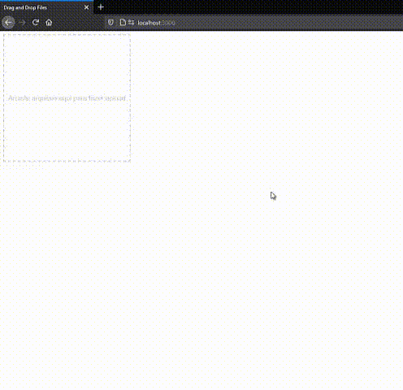

# Drag and Drop Files

### HTML, css e javascript



#### Página (index.html):

```HTML
<div id="uploads"></div>
<div class="dropzone" id="dropzone"> Arraste arquivos aqui para fazer upload</div>
```

#### Estilo (index.css):

```CSS
body {
  font-family: 'Arial', sans-serif;
}

.dropzone {
  width: 300px;
  height: 300px;
  border: 2px dashed #ccc;
  color: #ccc;
  line-height: 300px;
  text-align: center;
}

.dragover {
  border-color: #000;
  color: #000;
}
```

#### Script (index.js):

```JS
window.onload = function (e) {
  (function () {
    var dropzone = document.getElementById('dropzone');

    var upload = function (files) {
      const formData = new FormData();

      for (x = 0; x < files.length; x++) {
        formData.append('file', files[x]);
      }

      fetch('/uploads', {
        method: 'POST',
        headers: {
          Accept: 'application/json',
        },
        body: formData,
      })
        .then((res) => res.json())
        .then((results) => {
          console.log(results);
        })
        .catch((error) => {
          console.error(error);
        });
    };

    dropzone.ondrop = function (e) {
      e.preventDefault();
      this.className = 'dropzone';
      upload(e.dataTransfer.files);
    };

    dropzone.ondragover = function (e) {
      this.className = 'dropzone dragover';
      return false;
    };

    dropzone.ondragleave = function (e) {
      this.className = 'dropzone';
      return false;
    };
  })();
};

```

> Montando o servidor:

### Dependências:

- Express
- Morgan
- Nodemon
- Multer
- Ejs
- Dotenv

`$ npm install express morgan nodemon multer ejs dotenv --save`

#### Servidor (server.js):

```JS
require('dotenv').config();
const express = require('express');
const morgan = require('morgan');
const app = express();
const path = require('path');
const ejs = require('ejs');

app.use(express.static(path.join(__dirname, '..', 'public')));
app.set('views', path.join(__dirname, '..', 'public'));
app.engine('html', ejs.renderFile);
app.set('view engine', 'html');

app.use(require('./routers.js'));
app.use(morgan('dev'));
app.use(express.json());
app.use(express.urlencoded({ extended: true }));

app.use('/', (req, res) => {
  res.render('index.html');
});

app.listen(process.env.PORT, () => {
  console.log('Ouvindo a porta: ', process.env.PORT);
});
```

#### Rotas (routers.js):

```JS
const express = require('express');
const router = express.Router();
const path = require('path');
const multer = require('multer');
const multerConfig = require('./config/multer.js');

router.use(express.static(path.join(__dirname, '..', 'public')));
router.use(express.json());
router.use(express.urlencoded({ extended: true }));

router.post('/uploads', multer(multerConfig).array('file', 100), async (req, res) => {
  console.log(req.file);
  res.json({message: 'Ok'});
});

module.exports = router;
```

#### Multer Config (multer.js):

```JS
const multer = require('multer');
const path = require('path');
const crypto = require('crypto');

module.exports = {
  dest: path.resolve(__dirname, '..', 'tmp', 'uploads'),
  storage: multer.diskStorage({
    destination: (req, file, cb) => {
      cb(null, path.resolve(__dirname, '..', '..', 'temp', 'uploads'));
    },
    filename: (req, file, cb) => {
      crypto.randomBytes(16, (err, hash) => {
        if (err) cb(err);

        const fileName = hash.toString('hex') + '-' + file.originalname;
        cb(null, fileName);
      });
    },
  }),
  limits: {
    fileSize: 2 * 1024 * 1024 * 1024,
  },
  fileFilter: (req, file, cb) => {
    const allowedMimes = ['image/jpeg', 'image/pjpeg', 'image/png', 'image/gif', 'image/jpg', 'video/avi'];
    if (allowedMimes.includes(file.mimetype)) {
      cb(null, true);
    } else {
      cb(new Error('Tipo de arquivo inválido'));
    }
  },
};
```

#### Iniciar o servidor:

```JS
    npx nodemon src/server.js
```
